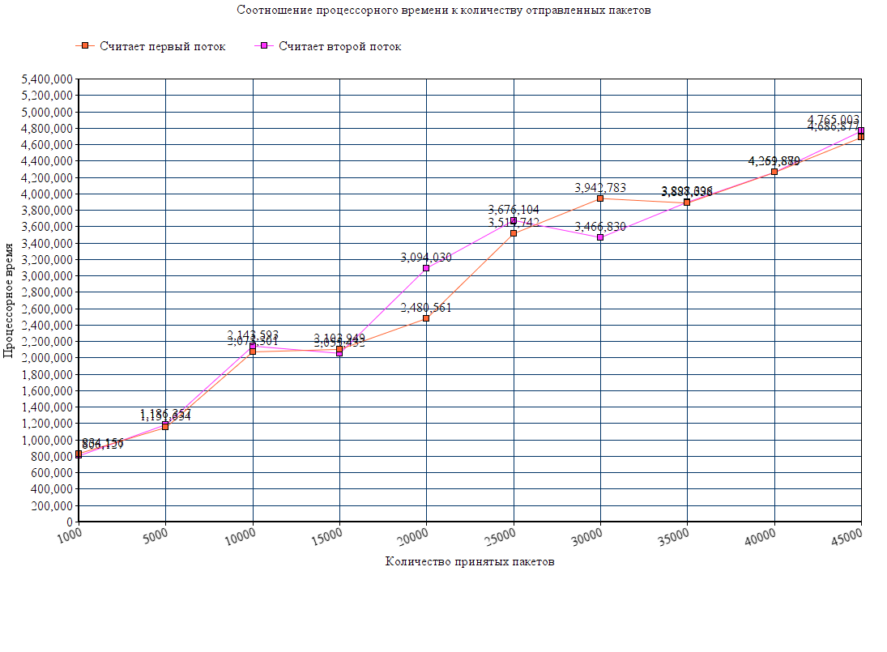

### UdpLab1
UdpLab1 - это набор программ по сбору стастистики о траффике с сетевого интерфейса и выводу на экран. Фильтрация проходит только по UDP пакетам.

### Сборка
Для систем Debian(проверено на 10 и 11) можно скачать пакет по этой [ссылке](https://github.com/MorganGrieves/UdpLab1/releases/tag/v0.0.1).
Для других систем существует возможность скомпилировать проект самостоятельно, выполнив команды:

`$ git clone https://github.com/MorganGrieves/UdpLab1.git && cd UdpLab1 && make release`

или в отладочном режиме с выводом дополнительной информации:

`$ git clone https://github.com/MorganGrieves/UdpLab1.git && cd UdpLab1 && make debug`

Утилиты будут находится в папке _./build/release/_ и _./build/debug/_ соотвественно.

### Запуск
UdpLab1 состоит из двух основных программ:
- udp-counter занимается сборкой, фильтрацией траффика и подсчетом статистики;
- stat-print работает в паре с udp-counter. Он производит подключение и выводит всю накопленную статистику на экран.

udp-counter дает возможность отфильтровать по ряду признаков:

- по IP источника
- по IP назначения
- по порту источника
- по порту назначения

Обратитесь к справке по команде `$ udp-counter --help`.

### Проверка работоспособности
Для проверки  использовался Netcat CLI. К примеру, для отправки ста UDP пакетов по адресу 1.1.1.1 в консоли Bash:

```$ for i in `seq 1 100`; do nc -u 1.1.1.1 9999; done```

Профилирование проходит с использованием известного инструмента valgrind. Моделируется ситуация, когда программа запускается с нужным фильтром. На интерфейс подаются блок из пакетов, как в примере выше, и отслеживается общее число принятых пакетов, памяти, а также количество аллокации / освобождения. Утечек не было обнаружено.
В работе используются два способа к подсчету статистики: через мьютексы в первом потоке, через пайпы во втором потоке. В среднем оба 
выдают тоже процессорное время в ходе проверки.



### Автор
Федоров Олег <fedorovoleg.1999@gmail.com>

### Лицензия
GNU GPLv3
